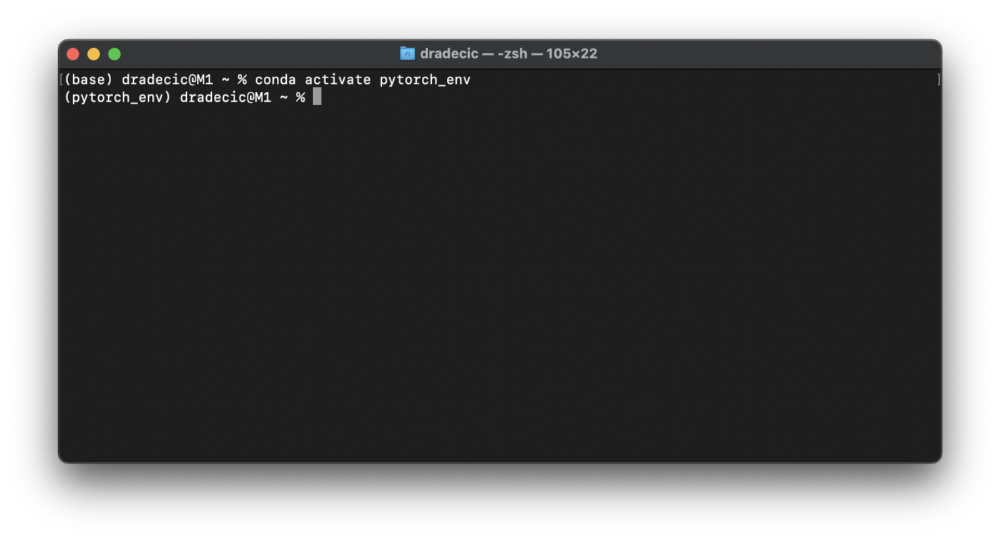
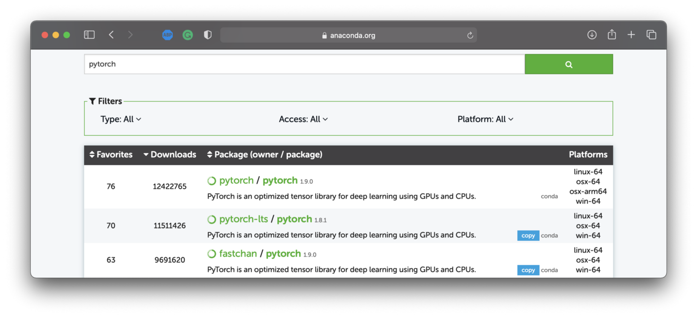
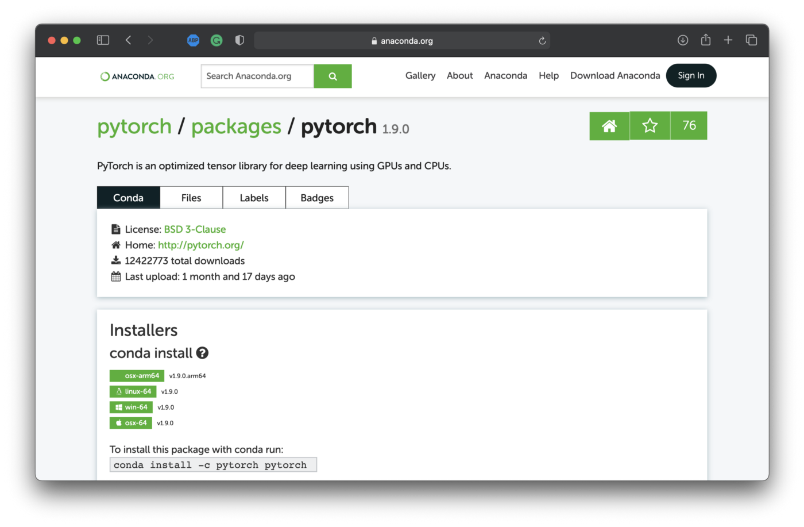
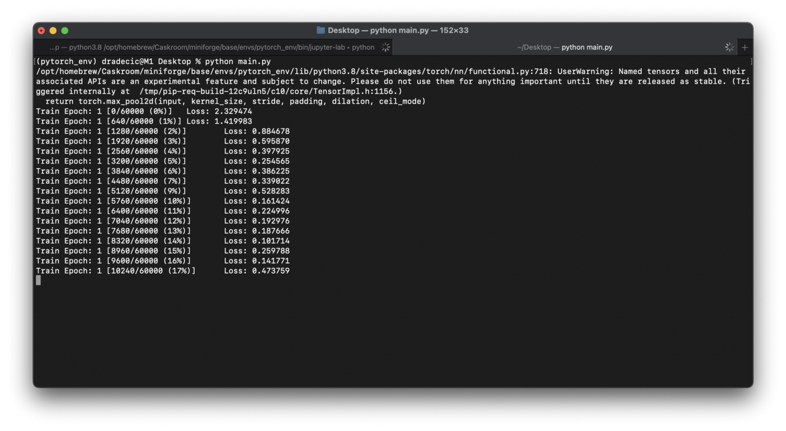
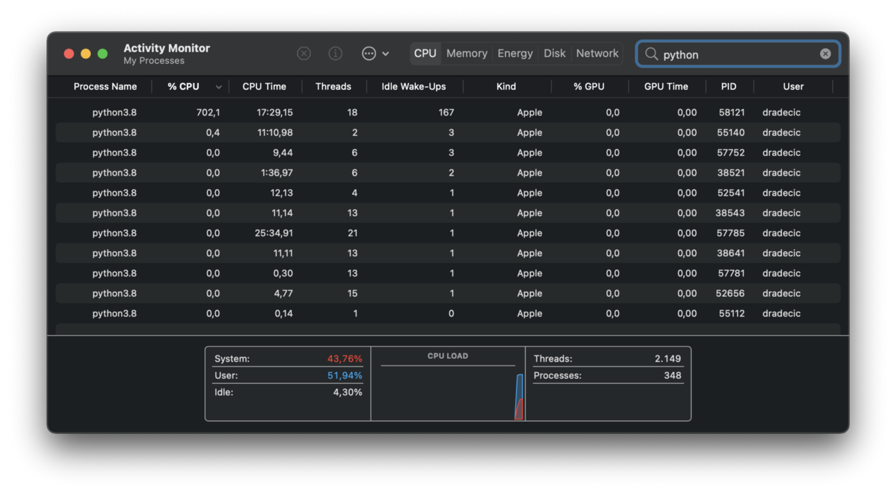

# pytorch_env_test
## Test environment configured for PyTorch
```main.py``` - это пограммка для теста среды (environment), настроенной для PyTorch.

Код программы взщят из примера по [ссылке](https://github.com/pytorch/examples/blob/master/mnist/main.py)
## Процесс установки ``PyTorch`` на макбуке с процессором M1
Проецесс описан в статье [по ссыле](https://towardsdatascience.com/yes-you-can-run-pytorch-natively-on-m1-macbooks-and-heres-how-35d2eaa07a83)

### **Step 1 — Install and configure Miniforge**
I’ve spent so much time configuring the M1 Mac for data science. It never worked without a flaw. Until I found this option. It will take you between 5 and 10 minutes to set up completely, depending on the Internet speed.

To start, you’ll need to install [Homebrew](I’ve spent so much time configuring the M1 Mac for data science. It never worked without a flaw. Until I found this option. It will take you between 5 and 10 minutes to set up completely, depending on the Internet speed.

To start, you’ll need to install Homebrew. It’s a package manager for Mac, and you can install it by executing the following line from the Terminal:

    /bin/bash -c "$(curl -fsSL https://raw.githubusercontent.com/Homebrew/install/HEAD/install.sh)"

Keep in mind — if you’re setting up a new M1 Mac, it’s likely you won’t have *XCode build tools* installed, which are required for Homebrew. The Terminal will inform you if these are missing and will ask if you want to install them.

Once both *XCode build tools* and Homebrew are installed, you can restart the Terminal and install Miniforge:

    brew install miniforge

It’s a couple of hundred MB download, so it will take some time to complete. Once done, initialize the conda for the Z shell (zsh):

    conda init zsh

Finally, restart the Terminal. That’s it! Miniforge is now installed and you’re ready to create virtual environments. Let’s do so next.)

### **Step 2 — Create a virtual environment**
The following Terminal command will create a new virtual environment named pytorch_env based on Python 3.8:

    conda create --name pytorch_env python=3.8

Once created, activate it with the following command:

    conda activate pytorch_env

You should see something like this:



Let’s install the libraries next.

### **Step 3 — Install PyTorch**
You can find a native PyTorch package on Anaconda’s website. You should look for osx-arm64 under Platform — that tells you it’s M1 compatible:



Clicking on the package will provide us with installation instructions, as you can see below:



You can use the following command to install both PyTorch and Torchvision (for datasets):

    conda install -c pytorch pytorch torchvision

And that’s it — PyTorch is now installed! Let’s test the damn thing next.

### **Step 4 — Testing**
Let’s keep it simple and don’t write anything from scratch. PyTorch’s GitHub page comes with many examples, one of which is the script for training a handwritten digit classifier [link](https://github.com/pytorch/examples/blob/master/mnist/main.py).

Simply download that script and run it from the Terminal:

    python main.py

You’ll see the following output:



Everything works as expected! Let’s open up the Activity Monitor to verify Python is running natively:



If you see ``Apple`` under ``Kin``, it means the program is running natively on the M1 chip, and not under the Rosetta emulator.

Check!
